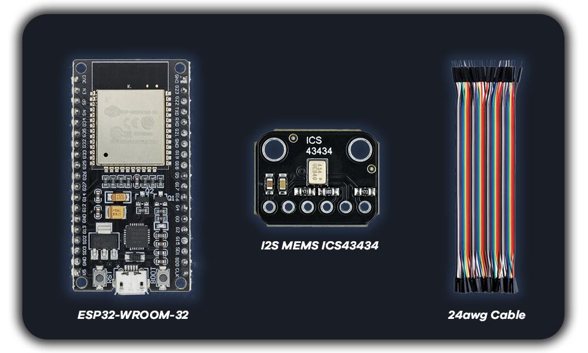

<p align="center">

</p>

---

<p align="center">

</p>

# Furtif-Audio v1.2

Microphone d’écoute à distance compact à base d’ESP32 avec streaming audio en temps réel via Wi‑Fi.

Ce dispositif permet de diffuser le son discrètement vers un navigateur web ou VLC, tout en offrant une interface web intuitive pour une gestion facile. Il intègre des réglages de sensibilité du microphone, un système intelligent de mise à jour du firmware, ainsi qu’un contrôle intégré du reset. 

---

## 🛠️ Matériel requis

| Composant    | Description                            |
| ------------ | -------------------------------------- |
| ESP32        | Module ESP32 WROOM-32                  |
| Microphone   | I2S MEMS ICS43434                      |
| Alimentation | 5V USB ou batterie LiPo                |
| Optionnel    | Boîtier compact, câbles et connecteurs |

<p align="center">

</p>

## 🔌 Connexions ESP32 WROOM-32 ↔ ICS43434

| Broche module | Signal I2S | ESP32 WROOM-32 |
|--------------------------------|------------|----------------|
| **3V**                          | VDD        | 3.3V           |
| **GND**                         | GND        | GND            |
| **BCLK**                        | BCLK       | GPIO 32        |
| **DOUT**                        | DATA       | GPIO 33        |
| **LRCL**                        | WS         | GPIO 25        |
| **SEL**                         | L/R        | GND (gauche)   |

---

## 📂 Fichiers inclus /bin

* `flash.bat` → Script batch Windows pour flasher tous les fichiers binaires sur l’ESP32 en une seule étape  
* `furtif.ino.bootloader.bin` → Bootloader ESP32  
* `furtif.ino.partitions.bin` → Table des partitions  
* `furtif.ino.bin` → Firmware principal ESP32  
* `littlefs.bin` → Contenu LittleFS (fichiers web et dashboard)

---

## ⚡ Flashage ESP32 (Windows)

### 1️⃣ Prérequis

* ESP32 connecté en USB
* Python 3.x installé
* `esptool.py` installé :

```bash
pip install esptool
```
---

### 2️⃣ Flashage via `flash.bat`

Utilise le fichier `flash.bat` dans le même dossier que tes binaires (`furtif.ino.bootloader.bin`, `furtif.ino.partitions.bin`, `furtif.ino.bin`, `littlefs.bin`).

#### ✅ Instructions

1. Connecte l’ESP32 à ton PC via USB.
2. Mets à jour `COM_PORT` du fichier `flash.bat` si nécessaire (vérifie le port dans le gestionnaire de périphériques).
3. Double-clique sur `flash.bat` → le bootloader, la table de partitions et le firmware seront flashés automatiquement.
4. L’ESP32 est prêt à être utilisé après avoir été rebranché.

---

## ⚙️ Configuration initiale Wi-Fi

1. Allume l’ESP32.
2. Connecte-toi au réseau Wi-Fi `FURTIF-AUDIO-Setup` avec le mot de passe `12345678`.
3. Ouvre un navigateur → `http://192.168.8.8/`.
4. Saisis ton SSID et mot de passe Wi-Fi → clique sur **Enregistrer**.
5. L’ESP32 redémarre et rejoint ton réseau.

---

## 🎧 Streaming audio

1. Récupérez l’adresse IP de l’ESP32 sur votre réseau.  
2. Ouvrez un navigateur et accédez à cette adresse IP.  
3. Connectez-vous à votre tableau de bord avec vos identifiants.
> 💡 Pour obtenir vos propres identifiants et accéder au micro ainsi qu’à toutes les fonctionnalités, contactez-moi à : paralax@fluctual.fr
4. Copiez l’URL du flux audio.  
5. Ouvrez VLC → Média → Ouvrir un flux réseau.  
6. Collez l’URL → écoutez en temps réel.

---

## ⚠️ Avertissement

Ce projet de dispositif d'écoute à distance est proposé uniquement à des fins pédagogiques et techniques.
Il ne doit en aucun cas être utilisé à des fins illégales ou pour porter atteinte à la vie privée d’autrui.

L’utilisateur est seul responsable de l’usage qu’il en fait. Veuillez vous assurer de respecter les lois et réglementations en vigueur dans votre pays avant toute utilisation.
