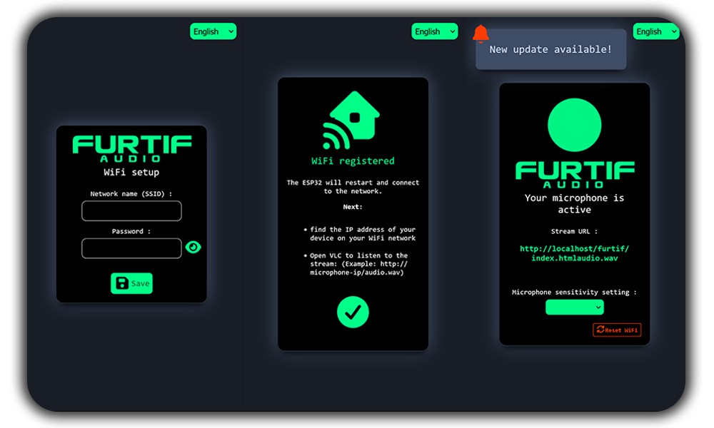

<p align="center">

</p>

---

<p align="center">

</p>

# Furtif-Audio v1.2

ESP32-based compact spy microphone with real-time audio streaming over Wi-Fi. Stream audio discretly to a browser or VLC.

---

## 🛠️ Matériel requis

| Composant    | Description                            |
| ------------ | -------------------------------------- |
| ESP32        | Module ESP32 WROOM-32                  |
| Microphone   | I2S MEMS ICS43434                      |
| Alimentation | 5V USB ou batterie LiPo                |
| Optionnel    | Boîtier compact, câbles et connecteurs |

---

## 📂 Fichiers inclus

* `furtif.ino.bootloader.bin` → Bootloader ESP32
* `furtif.ino.partitions.bin` → Table des partitions
* `furtif.ino.bin` → Firmware principal ESP32
* `/data` → Fichiers HTML, CSS, JS pour l’interface web (à uploader via Arduino IDE)

---

## ⚡ Flashage ESP32 (Windows)

### 1️⃣ Prérequis

* ESP32 connecté en USB
* Python 3.x installé
* `esptool.py` installé :

```bash
pip install esptool
```

### 2️⃣ Flashage via `.bat`

Parfait ! Voici une version claire et concise du **point 2 – Flashage via `.bat`** adaptée à ton projet avec les 3 fichiers bin et nommée `flash.bat` :

---

### 2️⃣ Flashage via `flash.bat`

Crée un fichier `flash.bat` dans le même dossier que tes binaires (`bootloader.bin`, `partition-table.bin`, `furtif.ino.bin`) avec ce contenu :

```bat
@echo off
REM ============================================
REM  Furtif-Audio - Flash ESP32 (tous les fichiers)
REM ============================================

set COM_PORT=COM3
set BAUD=921600

REM ----------------------------
REM Flash bootloader
REM ----------------------------
echo Flashing bootloader...
python -m esptool --chip esp32 --port %COM_PORT% --baud %BAUD% write-flash 0x1000 furtif.ino.bootloader.bin

REM ----------------------------
REM Flash partitions
REM ----------------------------
echo Flashing partitions...
python -m esptool --chip esp32 --port %COM_PORT% --baud %BAUD% write-flash 0x8000 furtif.ino.partitions.bin

REM ----------------------------
REM Flash firmware
REM ----------------------------
echo Flashing firmware...
python -m esptool --chip esp32 --port %COM_PORT% --baud %BAUD% write-flash 0x10000 furtif.ino.bin

REM ----------------------------
REM Fin
REM ----------------------------
echo All flashing steps complete! Unplug and replug your ESP32.
```

#### ✅ Instructions

1. Connecte l’ESP32 à ton PC via USB.
2. Mets à jour `COM_PORT` si nécessaire (vérifie le port dans le gestionnaire de périphériques).
3. Double-clique sur `flash.bat` → le bootloader, la table de partitions et le firmware seront flashés automatiquement.
4. L’ESP32 est prêt à être utilisé après avoir été rebranché.

---

## 💻 Upload des fichiers d’interface via Arduino IDE

1. Ouvre Arduino IDE et sélectionne ta carte ESP32.
2. Assure-toi d’avoir installé le plugin **ESP32 LittleFS Data Upload**.
3. Dans Arduino IDE, sélectionne **Tools → ESP32 LittleFS Upload**.
4. Choisis le dossier `/data` → clique sur **Upload**.
5. L’ESP32 aura l’interface web complète pour le streaming.

---

## ⚙️ Configuration initiale Wi-Fi

1. Allume l’ESP32.
2. Connecte-toi au réseau Wi-Fi `FURTIF-AUDIO-Setup`.
3. Ouvre un navigateur → `http://192.168.8.8/`.
4. Saisis ton SSID et mot de passe Wi-Fi → clique sur **Save**.
5. L’ESP32 redémarre et rejoint ton réseau.

---

## 🎧 Streaming audio

1. Récupère l’adresse IP de l’ESP32 sur ton réseau.
2. Ouvre un navigateur et navigue vers cette IP.
3. Copie l’URL du flux audio.
4. Ouvre VLC ou un autre lecteur réseau compatible.
5. Colle l’URL → écoute le streaming en temps réel.


